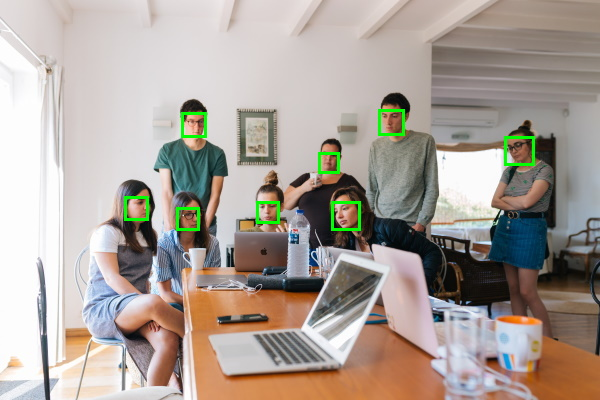
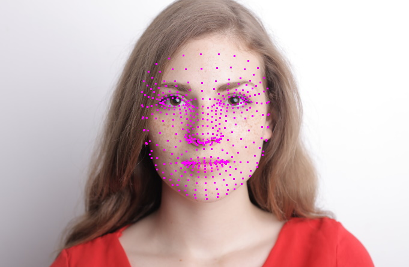
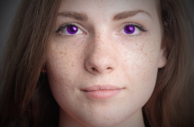

# Face Detection For Python

This package implements parts of Google®'s [**MediaPipe**](https://mediapipe.dev/#!) models in pure Python (with a little help from Numpy and PIL) without `Protobuf` graphs and with minimal dependencies (just [**TF Lite**](https://www.tensorflow.org/lite/api_docs) and [**Pillow**](https://python-pillow.org/)).

## Models and Examples

The package provides the following models:

* Face Detection



* Face Landmark Detection



* Iris Landmark Detection


* Iris recoloring example



## Motivation

The package doesn't use the graph approach implemented by **MediaPipe** and
is therefore not as flexible. It is, however, somewhat easier to use and
understand and more accessible to recreational programming and experimenting
with the pretrained ML models than the rather complex **MediaPipe** framework.

Here's how face detection works and an image like shown above can be produced:

```python
from fdlite import FaceDetection
from fdlite.render import Colors, detections_to_render_data, render_to_image 
from PIL import Image

image = Image.open('group.jpg')
detect_faces = FaceDetection()
faces = detect_faces(image)
if len(faces) == 0:
    print('no faces detected :(')
else:
    render_data = detections_to_render_data(faces, bounds_color=Colors.GREEN)
    render_to_image(render_data, image).show()
```

While this example isn't that much simpler than the **MediaPipe** equivalent,
some models (e.g. iris detection) aren't available in the Python API.

## Installation

The package can be installed by navigating to the folder containing `setup.py`
and running

```sh
pip install .
```

from a shell or command prompt.
