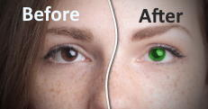
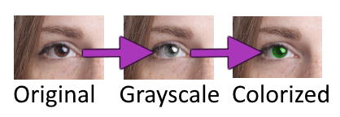
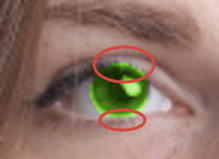
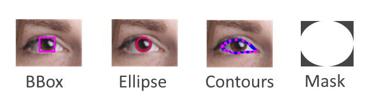

# Iris Recoloring Example Explained

For those interested in how the iris recoloring example is implemented,
this document goes into detail on how it works.

## Objective and General Approach

The goal of iris recoloring is to change the iris color from its original
appearance to another one. Ideally, we want the pupils and any reflections
to stay black and white respetively while changing the eye color to another
shade:



In order to keep things simple, we can isolate the iris, convert it to
grayscale and use [Pillow's colorize](https://pillow.readthedocs.io/en/stable/reference/ImageOps.html#PIL.ImageOps.colorize) function to apply a new tint:



We can then paste the recolored iris back into the image.
The `paste` function allows us to pass a mask image so we can easily leave
the sclera (the white part of the eyeball) untouched.

An initial attempt might look something like this:

```python
...
left_eye = detect_iris(image, left_eye_roi)
# isolate the iris
iris_location, iris_size = get_iris_position_and_size(left_eye, image)
iris = image.transform(iris_size, Transform.EXTENT, data=iris_location)
# grayscale
iris = iris.convert('L')
# create mask
mask = get_iris_mask(iris_size)
# apply color
iris_new = ImageOps.colorize(iris, 'black', 'white', mid=(120, 210, 45))
# paste results into image
image.paste(iris_new, iris_location, mask)
```

Getting the iris size- and position is straight forward. We already get the
landmarks that mark the iris position and -size with the iris detection
results:

```python
def get_iris_position_and_size(iris_results, image):
    bbox = bbox_from_landmarks(iris_results.iris).absolute(image.size)
    l, t, r, b = bbox.as_tuple
    # we add one pixel to the right and bottom because bounds are inclusive 
    iris_location = (int(l), int(t), int(r+1), int(b+1))
    iris_size = (int(bbox.width+1), int(bbox.height+1))
    return iris_location, iris_size
```

Creating the mask is simple as well if we know the size of the mask image:

```python
def get_iris_mask(iris_size):
    mask = Image.new(mode='L', size=iris_size)
    draw = ImageDraw.Draw(mask)
    draw.ellipse((0, 0, mask.width, mask.height), fill=255)
    return mask
```

The result would be ok, but we clearly colorize regions covered by the eyelids:



## Staying Within Boundaries

Using the parameters obtained from the bounding box, we can create an image
that represents a mask for colorizing. This would be great if we didn't have
the eye's contours to take into account. Here's what we've got so far:



We need to adjust the mask such that the parts covered by the eyelids are
also masked and not colorized. There are a few ways of achieving this. One
idea is to draw the mask manually and checking each point whether it's
within the eye contours.

## What's Our Vector, Victor? - Dealing With Contour Segments

The contours of the eye are part of the iris detection results and consist
of a series of (3d) points. We can sort the points by their x value and use
a line sweep algorithm to determine line segments.  
The algorithm to create a mask image that respects the eye contours is quite
simple.

```pseudocode
        ' ellipse center
        let cx, cy = mask_height/2, mask_width/2
        ' we use a and b (the ellipse radii) for clarity
        let a, b = mask_height/2, mask_width/2
        for y from 0 to *mask_height*
            ' find left and right ellipse boundary point at y 
            ' x₁ is the left and x₂ is the right ellipse boundary 
            let x₁, x₂ = cx±a•sqrt(b²-(y-cy)²/b)
            find contour line segment AB₁ that contains x₁
            find contour line segment AB₂ that contains x₂
            if y is above AB₁ and above AB₂ skip to next y
            if y is above AB₁ set x₁ = intersection of AB₁ and ellipse
            if y is above AB₂ set x₂ = intersection of AB₂ and ellipse
            mark points from (x₁, y) to (x₂, y) as visible part of iris
```

x₁ and x₂ are outside the mask if they are located below their matching segments
if the y coordinate of the starting point is below the center of the eye.
Another important detail is the fact that x might match two line segments -
one above and one below it. We select the segment with the closest starting
point in that case.

That's just one way of doing it. The results won't be pixel perfect for
various reasons. One improvement might be blending towards the edges of the
mask or growing/shrinking the mask based on traditional edge detection.
